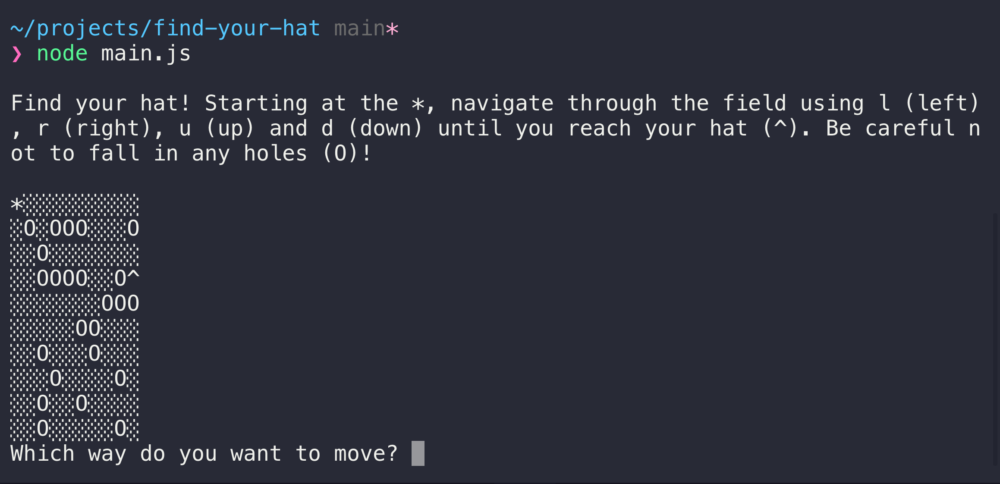

# Find your hat!

A interactive game played in the terminal using Node.js

You've lost your hat in a field full of holes! Navigate your way through the field to find your missing hat (^) - be careful not to fall in any holes (O) on the way

## Table of contents
* [General info](#general-info)
* [Screenshot](#screenshot)
* [Technologies](#technologies)
* [Setup](#setup)
* [Status](#status)
* [Inspiration](#inspiration)
* [Contact](#contact)

## General info

This project is part of Codecademy's Full Stack Engineer Career pathway.

I was required to use my existing knowledge of JavaScript to build the logic for the game, incorporating ES6 class syntax and methods.

This project introduced me to working with user input in Node.js.

## Screenshot

## Technologies

* Node.js
* JavaScript

## Setup

1. [Clone](https://docs.github.com/en/free-pro-team@latest/github/creating-cloning-and-archiving-repositories/cloning-a-repository) this repository to your local machine.

2. Ensure you have [Node.js](https://nodejs.org/en/download/) installed on your machine.

3. In your terminal, navigate to your  newly-created `find-your-hat` folder and run `npm install` to install the 'prompt-sync' dependency (a node module that enables you to play the game by entering prompts in terminal).

4. Run `node main.js` to launch the game.

    Follow the instructions on the screen to navigate through the field, starting from * in the top left of the field. To move, type `l`, `r`, `u` or `d` and hit enter.

    If you fall in a hole, you will lose and the game will automatically quit. To play again, run the `node main.js` command again in your terminal.

    To quit the game at any point, press CTRL + C.

    _N.b If you find your game starts with a * surrounded by holes, trapping you in, or the maze cannot be solved, simply quit (ctrl + c) and run `node main.js` again to generate another random field. (The [maze solving algorithm](https://en.wikipedia.org/wiki/Maze_solving_algorithm) is a bit beyond my skills at the moment (but watch this space!))_

## Status
Project is:  _complete_

## Inspiration
Project based on Codecademy's 'Find your hat' project, part of the Full Stack Engineer career pathway.

## Contact
Created by [@jlopenshaw](https://twitter.com/Jlopenshaw) - feel free to contact me